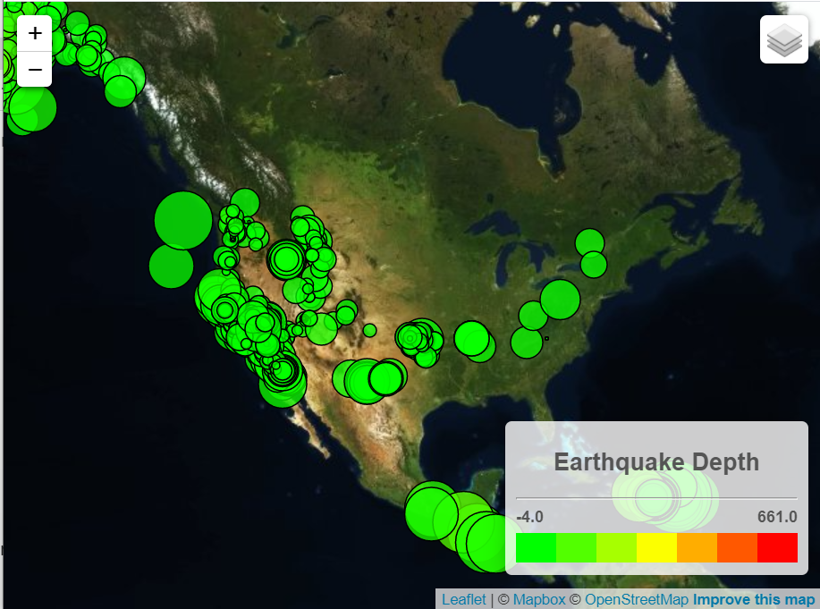

# Visualizing Data with Leaflet
This project implements the Leaflet library to display earthquake data.

Data and starter code provided by the University of Minnesota. 
Tectonic Plate data from [https://github.com/fraxen/tectonicplates](https://github.com/fraxen/tectonicplates). 
Earthquake data from [USGS](https://earthquake.usgs.gov/earthquakes/feed/v1.0/geojson.php).

## How to Run
<ol>
    <li>Download or clone this repository.</li>
    <li>Go to static > js and make a copy of <b>config-template.js</b>.</li>
    <li>Rename the copy of <b>config-template.js</b> to <b>config.js</b>.</li>
    <li>Edit <b>config.js</b> to set API_KEY to a <a href="https://www.mapbox.com/">valid MapBox API key</a>.</li>
    <li>
    Open index.html using a local server. You should see a map similar to the below image:
    
    </li>
</ol>
